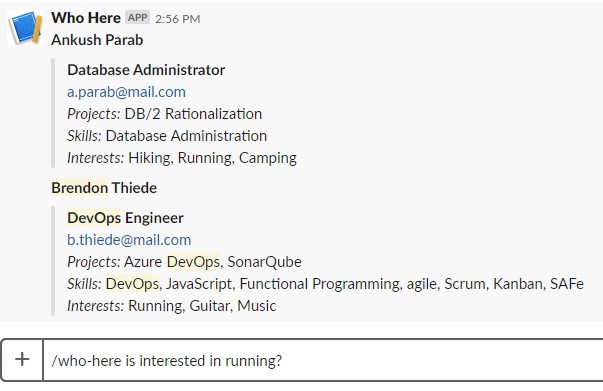

# Who Here



## Purpose

The _Who Here_ app was created of a "Hack Day". The problem statement was that there are many people around the office that you don't know, but may have similar interests. Rather than try to come up with a separate CRUD application for people to enter their data, we decided to leverage the information that was already available from SharePoint, which we discovered is exposed by the Microsoft Graph API.

## Technology

The app is a .NET Core Web API, intended for use with Slack as a Slash Command. It uses the Microsoft Graph API to pull user profiles from Office 365. For managing the application life cycle, there is also a PSake script to manage tasks like testing, publishing, and deploying.

## Text Parsing Strategy

There are many services, in particular [Microsoft's LUIS](https://docs.microsoft.com/en-us/azure/cognitive-services/luis/), that can help with providing an understanding of the intents and entities within text, however, I wanted to try it manually. The code is in `TextToIntentParser.cs` and mainly has a strategy of looking for a "property" or one of it's tenses or aliases, removes any "noise" words (as, is, are, to...) either directly before or after the property, and then assumes anything else is the search text to look for in the known values of the property.

## Creating an App Registry

You will need to create an App Registration to be used as a App registration to connect to Microsoft Graph. Generally speaking, it's a good idea to have one App registration per environment. There are some instructions here: [ASP.NET Graph Example](https://docs.microsoft.com/en-us/graph/tutorials/aspnet?tutorial-step=2). When creating the app registration, keep track of the Application ID and the redirect Uri that you chose (it can just be https://localhost:5001 or anything else you choose, since it won't actually be used). You will also need to generate a client secret and keep track of that.

## Running Unit Tests

You can run unit tests by running `dotnet test` against the test csproj directly, or by using PSake:

```powershell
.\scripts\build.ps1 -Task Test
```

## Running Locally

In order to run locally, you will need to create a file named `appsettings.json` with contents like this:

```json
{
  "graph": {
    "applicationId": "ID_FROM_AZURE_ACTIVE_DIRECTORY",
    "applicationSecret": "CLIENT_SECRET_FROM_AZURE_ACTIVE_DIRECTORY",
    "tenantId": "TENANT_ID_OF_AZURE_ACTIVE_DIRECTORY",
    "redirectUri": "https://localhost:5001",
    "domain": "my.mail.com"
  },
  "slack": {
    "slashCommandToken": "abc123"
  }
}
```

The value of the `slashCommandToken` doesn't matter locally, but you just need to match it in Postman or whatever you use to hot your local endpoint.

Now you can run the app locally either using your IDE (e.g. pressing F5 in VS Code and many other IDEs) or by running PSake:

```powershell
.\scripts\build.ps1 -Task Run
```

## Deploying From Your Machine

You should set up the Slash Command in Slack (instructions [here](https://api.slack.com/slash-commands)). You can guess at the URL for the application for now and you can go back and update it later, but for now just grab the "Verification Token" shown under the App Credentials configured for the Slash Command.

Now you can deploy the infrastructure via the ARM template. To start with, you should copy `who-here.parameters.example.json` to `who-here.parameters.json` and place the appropriate values in the parameters file. Note that the webAppName will need to be unique across all Azure Websites, since the same name will produce the same URL. You can mitigate this using the `uniqueString` template function in your ARM template, which will create a consistent value that is unique within the given context, which makes it unlikely that someone else would use the same exact name, and you won't step on your own toes if you deploy multiple environments (as long as you keep them in separate resource groups). Now you can deploy the infrastructure like this:

```powershell
.\scripts\build.ps1 -Task DeployInfrastructure
```

_Make sure you don't put the parameters file in source control with any of the secrets in it!!!_

For more fine-grained control over the ARM template deployment you can run the included `New-ARMTemplateDeployment.ps1` script, or just directly call `New-AzureRmResourceGroupDeployment` (you will have to make sure the target resource group exists first).

With the infrastructure deployed, you can deploy the web app artifacts like this:

```powershell
.\scripts\build.ps1 -Task DeployWebApp -Configuration Release
```

If you have more than one web app deployed in the same resource group, you will need to specify the `WebAppName` parameter as well.

## Deployment Pipeline

Rather than deploying from your machine, you should allow a CI/CD pipeline to handle the deployment. A basic pipeline would have a build that produces a deployable artifact that would be deployed by release stages, like this:

* Code push triggers build
  * Run unit tests: `.\scripts\build.ps1 -Task Test`
  * Generate deployable: `.\scripts\build.ps1 -Task Publish -Configuration Release`
  * Save `.\dist\WhoHere.zip` and `.\scripts\` as artifacts to pass along to the release stages
* Successful build triggers first release stage (Dev, Test, Demo, or whatever you call it)
  * Deploy infrastructure by using `who-here.template.json`
  * Deploy the zip file to the web app
* Criteria for triggering next release stage...

## Usage

Once the Slash Command is installed, you invoke it as `/who-here <property> <filter>`. To get a list of available search properties, invoke it as `/who-here help`. All searches go against cached data, which may not show changes made to profiles within the last usage (each invocation causes the cache to refresh, which may take a couple minutes).

## Updating User Profiles

In order to update your user profile to better enable searches with the app, you can add or change details for your profile by going to [https://delve-gcc.office.com](https://delve-gcc.office.com). Once logged in, you can click your initials in the upper right hand corner and select "My profile" in order to get to your profile. Once there, click "Update profile". Now you can scroll to the items you want to update, such as projects, skills, and interests. Looking for inspiration? Check out what people are already listing by looking at one of the list commands, such as `/who-here projects list`
